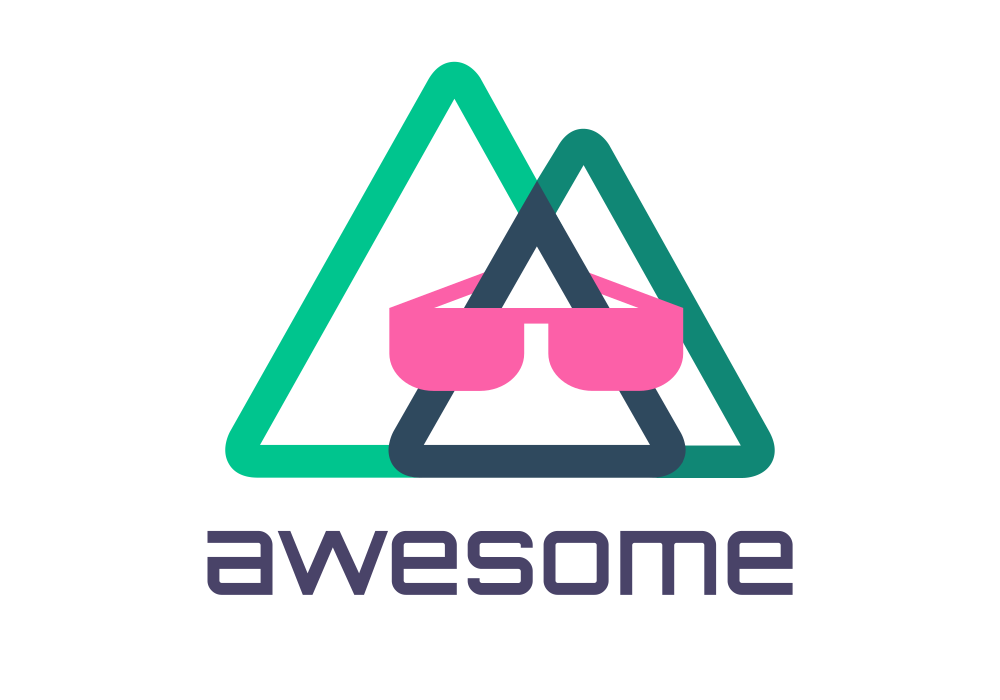

   
  
   
   

## Awesome Nuxt.js 

> A curated list of awesome things related to [Nuxt.js](https://github.com/nuxt/nuxt.js).

Nuxt.js is a framework for creating Universal Vue.js Applications.

> 💡 **Notice**: 
> We added a new section for [Open source projects using Nuxt](#open-source-projects-using-nuxt), we urge you to move your projects to that section if you already have them in [Projects using Nuxt](#projects-using-nuxt) section.

## Contents

- [Official Resources](#official-resources)
- [Community](#community)
- [Modules](#modules)
- [Tools](#tools)
- [Mention of Nuxt](#mention-of-nuxt)
- [Tutorials](#tutorials)
- [Blogs](#blogs)
- [Books](#books)
- [Starter Template](#starter-template)
- [Docker](#docker)
- [Official Examples](#official-examples)
- [Community Examples](#community-examples)
- [Open source projects using Nuxt](#open-source-projects-using-nuxt)
- [Projects Using Nuxt](#projects-using-nuxt)

### Official Resources

- [Official Guide](https://nuxtjs.org/guide)
- [API Reference](https://nuxtjs.org/api)
- [GitHub Repo](https://github.com/nuxt/nuxt.js)
- [Release Notes](https://github.com/nuxt/nuxt.js/releases)
- [Nuxt Modules](https://modules.nuxtjs.org)

### Community

- [YouTube](https://www.youtube.com/channel/UCJ9jj5YMzo-HsyM6WG9Q_Lg)
- [Twitter](https://twitter.com/nuxt_js)
- [Gitter Chat Room](https://gitter.im/nuxt/nuxt.js)
- [Discord](https://discordapp.com/invite/VApZF5W)
- [Telegram, Russian community](https://t.me/nuxtjs_ru)

### Modules

Discover the full list of Nuxt modules on https://modules.nuxtjs.org

#### Official

- [PWA](https://github.com/nuxt-community/pwa-module) - Supercharge Nuxt with a heavily tested, updated and stable PWA solution.
- [Axios](https://github.com/nuxt-community/axios-module) - Secure and easy Axios integration with Nuxt.js.
- [Apollo](https://github.com/nuxt-community/apollo-module) - Nuxt.js module to use vue-apollo (integrates graphql-tag loader to parse .gql & .graphql files).
- [Auth](https://github.com/nuxt-community/auth-module) - Authentication module for Nuxt.js.
- [Dotenv](https://github.com/nuxt-community/dotenv-module) - Loads your .env file into your application context.
- [Google-analytics](https://github.com/nuxt-community/analytics-module) - Google Analytics integration for Nuxt.js with vue-analytics.
- [Sitemap](https://github.com/nuxt-community/sitemap-module) - Automatically generate or serve dynamic `sitemap.xml` for Nuxt.js projects.
- [Blog](https://github.com/nuxt-community/blog-module) - Create a blog with Nuxt.
- [Router](https://github.com/nuxt-community/router-module) - Nuxt.js module to use router.js instead of pages/ directory.
- [OAuth](https://github.com/samtgarson/nuxt-oauth) - Simple OAuth2 integration for your Nuxt app.
- [Sentry](https://github.com/nuxt-community/sentry-module) - Enables error logging through [Sentry](https://sentry.io).
- [Webpack Monitor](https://github.com/nuxt-community/webpackmonitor-module) - Monitor nuxt webpack optimization metrics using [webpackmonitor](https://github.com/webpackmonitor/webpackmonitor).
- [AdSense](https://github.com/nuxt-community/adsense-module) - Google AdSense integration for Nuxt.js.
- [Vuetify](https://github.com/nuxt-community/vuetify-module) - Material Component Framework.
- [Browserconfig](https://github.com/nuxt-community/modules/tree/master/packages/browserconfig) - Adds XML browser configuration support.
- [Bulma](https://github.com/nuxt-community/modules/tree/master/packages/bulma) - Leverage bulma CSS.
- [Component-cache](https://github.com/nuxt-community/component-cache-module) - The vue-server-renderer has built-in support for component-level caching. This module automatically adds a LRU cache to project.
- [Font-awesome](https://github.com/nuxt-community/fontawesome-module) - Leverage Font Awesome the iconic font and CSS toolkit.
- [Font-awesome 5](https://github.com/Qonfucius/nuxt-fontawesome) - Use fontawesome 5 as a nuxtJS module.
- [GTM](https://github.com/nuxt-community/gtm-module) - Google Tag Manager (GTM) Module for Nuxt.js. This plugin automatically sends first page and route change events to GTM.
- [Localtunnel](https://github.com/nuxt-community/modules/tree/master/packages/localtunnel) - Localtunnel exposes your localhost to the world for easy testing and sharing! No need to mess with DNS or deploy just to have others test out your changes.
- [Markdownit](https://github.com/nuxt-community/markdownit-module) - Using markdownit-loader and markdown-it.
- [Toast](https://github.com/nuxt-community/modules/tree/master/packages/toast) - Responsive Touch Compatible Toast plugin for Nuxt.js using vue-toasted.
- [Vendor](https://github.com/nuxt-community/modules/tree/master/packages/vendor) - This awesome little modules creates junction symlinks from node_modules into static/vendor so you can directly serve node modules inside web. Useful for runtime dependencies.
- [Yandex-metrika](https://github.com/nuxt-community/yandex-metrika-module) - Add Yandex Metrika to your nuxt.js application.
- [Feed](https://github.com/nuxt-community/feed-module) - Add RSS, ATOM and JSON feeds to your application.
- [Redirect](https://github.com/nuxt-community/redirect-module) - Simplify setting up correct URL redirection with NuxtJS. No more cumbersome redirects!
- [I18n](https://github.com/nuxt-community/i18n-module) - Add i18n capabilities to your Nuxt project.
- [Separate Env](https://github.com/nuxt-community/separate-env-module) - Tear apart your variables and split them up for client/server bundle!
- [Logrocket](https://github.com/nuxt-community/nuxt-logrocket) - LogRocket module for Nuxt.js.
- [Universal Storage Module](https://github.com/nuxt-community/universal-storage) - Universal Storage Utilities for Nuxt.js.
- [Google Optimize](https://github.com/nuxt-community/google-optimize) - SSR friendly Google Optimize module for Nuxt.js.
- [Emotion](https://github.com/nuxt-community/emotion-module) - Emotion CSS-In-JS module for Nuxt.js.
- [SVG](https://github.com/nuxt-community/svg-module) - Easy way to use SVG files in Nuxt.js.
- [SVG Sprite](https://github.com/nuxt-community/svg-sprite-module) - Optimized and Easy way to use SVG files in Nuxt.js.
- [ReCaptcha](https://github.com/nuxt-community/recaptcha-module) - Simple and easy Google reCAPTCHA integration with Nuxt.js.
- [Device](https://github.com/nuxt-community/device-module) - Device detection module for Nuxt.js.
- [TailwindCSS](https://github.com/nuxt-community/nuxt-tailwindcss) - TailwindCSS module for Nuxt.js with PurgeCSS.
- [AMP](https://github.com/nuxt-community/amp-module) - AMP module for Nuxt.
- [Color Mode](https://github.com/nuxt-community/color-mode-module) - Dark and Light mode with auto detection made easy with NuxtJS
- [Cloudinary](https://github.com/nuxt-community/cloudinary-module) - Cloudinary module for Nuxt.js for optimizing images and videos on the fly with Cloudinary.

#### Community

- [BootstrapVue](https://bootstrap-vue.org/docs/#nuxtjs-module) - Bootstrap v4 components and grid system for Nuxt.js.
- [SocialMeta](https://github.com/AlekseyPleshkov/nuxt-social-meta) - Generate meta-tags for social network - Facebook and Twitter.
- [Vue Material](https://github.com/vaso2/nuxt-vue-material) - Vue Material framework integration with Nuxt.
- [Simple Line Icons](https://github.com/vaso2/nuxt-simple-line-icons) - Simple Line Icons for Nuxt.
- [nuxt-laravel](https://github.com/m2sd/nuxt-laravel) - Updated version of laravel-nuxt that exteds nuxt cli command.
- [cookie-universal-nuxt](https://github.com/microcipcip/cookie-universal/tree/master/packages/cookie-universal-nuxt) - Universal cookie plugin for Nuxt, perfect for SSR.
- [Buefy](https://github.com/buefy/nuxt-buefy) - Lightweight UI components for Vue.js based on Bulma for Nuxt.
- [Font Awesome 5](https://github.com/vaso2/nuxt-fontawesome) - Alternative module for Fontawesome 5 integration with ES6 imports and tree shaking.
- [Matomo](https://github.com/pimlie/nuxt-matomo) - Matomo/Piwik integration for Nuxt.
- [RealFaviconGenerator Icons](https://github.com/pimlie/nuxt-rfg-icon) - Automatically generate favicons and app icons using RealFaviconGenerator.net's api.
- [Nuxt Validate](https://github.com/lewyuburi/nuxt-validate) - Simple Nuxt input validation module using vee-validate.
- [nuxt-bulma-slim](https://github.com/mustardamus/nuxt-bulma-slim) - Module to automatically make a slim Bulma build of used features.
- [Nuxt7](https://github.com/nuxt-community/nuxt7) - Framework7-Vue Nuxt integration.
- [Leaflet.js](https://github.com/schlunsen/nuxt-leaflet) - Leaflet.js integration for Nuxt.
- [Nuxt Express](https://github.com/uptownhr/nuxt-express-module) - Express module for Nuxt (hot reload).
- [Vue.js Warehouse](https://github.com/bazzite/vue-warehouse) - Cross-browser storage for Vue.js and Nuxt.js, with plugins support and easy extensibility based on Store.js.
- [nuxt-ts-module](https://github.com/chanlito/nuxt-ts-module) - Tiny module to use TypeScript within Nuxt.js application.
- [nuxt-typescript](https://github.com/wagerfield/nuxt-typescript) - Lightening fast type checking and linting with TypeScript and TSLint.
- [nurdism/nuxtjs-electron](https://github.com/nurdism/nuxtjs-electron) - Utility module that helps you work with electron inside nuxt.
- [nuxt-babel](https://github.com/wemake-services/nuxt-babel) - Use normal `.babelrc` file with your Nuxt app.
- [nuxt-imagemin](https://github.com/wemake-services/nuxt-imagemin) - Nuxt module to minify your images. Works with: `png`, `jpeg`, `gif`, and `svg`.
- [nuxt-neo](https://github.com/ezypeeze/nuxt-neo) - Create your middleware api using a universal access point approach from your vue pages.
- [nuxt-viewport](https://github.com/mvrlin/nuxt-viewport) - Define custom viewports for your Nuxt project.
- [nuxt-mq](https://github.com/vanhoofmaarten/nuxt-mq) - Vue MQ module for Nuxt.js.
- [nuxt-content-git](https://github.com/dword-design/nuxt-content-git) - Set @nuxt/content createdAt and updatedAt dates from Git history. 
- [kentico-kontent-nuxt-module](https://github.com/Domitnator/kentico-kontent-nuxt-module) - Add Kentico Kontent super power to your Nuxt app.
- [nuxt-client-init-module](https://github.com/potato4d/nuxt-client-init-module) - Provide client version of nuxtServerInit.
- [Nuxt Webpack Dashboard](https://github.com/paulgv/nuxt-webpackdashboard) - Webpack Dashboard integration for Nuxt.
- [Nuxt Vuex Router Sync](https://github.com/paulgv/nuxt-vuex-router-sync) - [vuex-router-sync](https://github.com/vuejs/vuex-router-sync) integration for Nuxt.
- [nuxt-rollbar-module](https://github.com/zevran/nuxt-rollbar-module) - Rollbar module for NuxtJS.
- [Nuxt Image Loader Module](https://github.com/reallifedigital/nuxt-image-loader-module) - Nuxt module to automatically resize, rotate, blur, watermark and crop images.
- [Nuxt-Storage](https://github.com/mazipan/nuxt-storage) - Utilities for easy read and write browser's storage in Nuxt.js project.
- [nuxt-svg-loader](https://github.com/Developmint/nuxt-svg-loader) - Load your SVGs as you'd load your Vue components.
- [nuxt-purgecss](https://github.com/Developmint/nuxt-purgecss) - Drop superfluous CSS!
- [nuxt-bundle-buddy](https://github.com/Developmint/nuxt-bundle-buddy) - Don't fight your webpack bundle, become friends!
- [prismic-nuxt](https://github.com/jamespegg/prismic-nuxt) - Prismic.io headless CMS integration for Nuxt.
- [nuxt-fire](https://github.com/lupas/nuxt-fire) - Easily integrate Firebase into your Nuxt 2 project. 🔥
- [nuxt-webfontloader](https://github.com/Developmint/nuxt-webfontloader) - Efficient web font loading has never been easier!
- [nuxt-sweetalert2](https://github.com/ImreC/nuxt-sweetalert2) - Sweetalert2 module based on vue-sweetalert2 with global options.
- [nuxt-netlify-http2-server-push](https://github.com/jmblog/nuxt-netlify-http2-server-push) - Enable HTTP/2 server push on Netlify.
- [nuxt-svg-sprite-module](https://github.com/gaven/nuxt-svg-sprite-module) - Add an inline svg sprite to your Nuxt app.
- [nuxt-fullpage.js](https://github.com/vaso2/nuxt-fullpage.js) - Nuxt module for fullPage.js, create fullscreen scrolling websites.
- [fullpage-nuxt](https://github.com/vaso2/fullpage-nuxt) - Nuxt module for fullpage-nuxt directive, pure Vue implementation of per-page scrolling.
- [nuxt-user-agent](https://github.com/fukuiretu/nuxt-user-agent) - Nuxt module for handling User-Agent.
- [nuxt-basic-auth-module](https://github.com/potato4d/nuxt-basic-auth-module) - Provide basic auth your Nuxt.js application.
- [nuxt-wizard](https://www.npmjs.com/package/nuxt-wizard) - Command-line interface for scaffolding Nuxt projects.
- [nuxt-payload-extractor](https://github.com/DreaMinder/nuxt-payload-extractor) - Module that saves external API data to static JSON files on 'nuxt generate' command, making your project fully static.
- [nuxt-apis-to-file](https://github.com/LuXDAmore/nuxt-apis-to-file) - Module to merge and transform static API calls into a single file during the build process.
- [cloudcms-nuxt](https://github.com/gitana/cloudcms-nuxt) - Cloud CMS Nuxt integration.
- [nuxt-vue-multiselect](https://github.com/spektrummedia/nuxt-vue-multiselect) - Single / multiple select plugin for Nuxt.js using vue-multiselect.
- [nuxt-optimized-images](https://github.com/bazzite/nuxt-optimized-images) - Automatically optimizes images used in Nuxt.js projects (JPEG, PNG, SVG, WebP and GIF).
- [nuxt-netlify](https://github.com/bazzite/nuxt-netlify) - Dynamically generate `_headers` and `_redirects` files for Netlify in your Nuxt.js projects.
- [nuxt-shopify](https://github.com/Gomah/nuxt-shopify) - Seamless Shopify Buy SDK integration with Nuxt.js.
- [nuxt-ghost-starter](https://github.com/Maxbrain0/nuxt-ghost-starter) - Generate a static blog using Ghost's Content API.
- [nuxt-zendesk](https://github.com/DansMaCulotte/nuxt-zendesk) - Nuxt module for Zendesk Web Widget.
- [nuxt-feature-toggle](https://github.com/stephenkr/nuxt-feature-toggle) - Nuxt module for managing feature toggles.
- [wuxt](https://github.com/northosts/wuxt) - Dockerized headless WordPress + Nuxt.js development environment.
- [nuxt-sanity](https://github.com/vicbergquist/nuxt-sanity) - Easily integrate [Sanity](https://www.sanity.io) in your Nuxt.js project.
- [nuxt-helmet](https://github.com/victor-perez/nuxt-helmet) - Easy [Helmet](https://helmetjs.github.io/) integration with Nuxt.js.
- [nuxt-parse](https://github.com/cierrateam/nuxt-parse) - Integration of the Parse SDK (JavaScript) in Nuxt.js.
- [WP-API](https://github.com/yashha/wp-nuxt) - Easy WordPress Api [WP-API](https://github.com/WP-API/node-wpapi) integration for you Nuxt app.
- [Xui](https://github.com/MetaCorp/xui-module) - Light module to help design websites with Nuxt.
- [nuxt-axios-duplicate-blocker](https://www.npmjs.com/package/nuxt-axios-duplicate-blocker) - Nuxt module that adds axios interceptors in order to block duplicate API requests and return results from the latest request to all callee functions. It can also be optionally used to cancel active requests when switching between pages.
- [nuxt-mobile-detect](https://github.com/ChanningDefoe/nuxt-mobile-detect) - Nuxt module for detecting the users device client-side and server-side.
- [nuxt-modernizr](https://github.com/dword-design/nuxt-modernizr) - Adds a Modernizr build to your Nuxt app.
- [nuxt-bugsnag](https://github.com/JulianMar/nuxt-bugsnag) - Use bugsnag as module.
- [nuxt-vue-select](https://github.com/madmod/nuxt-vue-select) - Nuxt module for [vue-select](https://vue-select.org/).
- [nuxt-socket-io](https://github.com/richardeschloss/nuxt-socket-io) - Nuxt module for [socket.io-client](https://github.com/socketio/socket.io-client)! Easy! Works with Nuxt 2.x.
- [nuxt-seomatic-meta](https://github.com/ben-rogerson/nuxt-seomatic-meta) - A module connecting Nuxt.js to the Craft CMS SEOmatic plugin via GraphQL.
- [nuxt-chuck](https://bitbucket.org/thecodetheorist/nuxt-chuck) - Nuxt module for displaying a random Chuck Norris joke in your NuxtJS app. Comes complete with it's own database and also uses VueX.
- [nuxt-stories](https://github.com/richardeschloss/nuxt-stories) - Nuxt module for painless storybooking.
- [nuxt-ghost-blog](https://github.com/moso/nuxt-ghost-blog) - Turn your Ghost blog into an SSR PWA by using the [Ghost Content API](https://ghost.org/docs/api/v3/content) and Vuex.
- [nuxt-i18n-boilerplate](https://github.com/Wssn/nuxt-i18n-boilerplate) - Minimalistic Boilerplate for Nuxt.JS applications with fully ready and SEO friendly Nuxt i18n module.
- [nuxt-moment-module](https://github.com/kdydesign/nuxt-moment-module) - Easy Moment.js integration with Nuxt.js.
- [nuxt-typed-router](https://github.com/victorgarciaesgi/nuxt-typed-router) - Provide autocompletion for pages route names generated by Vue router.
- [nuxt-history-state](https://github.com/hidekatsu-izuno/nuxt-history-state) - History State Module for Nuxt.js.
- [nuxt-alias-module](https://github.com/kdydesign/nuxt-alias-module) - It automatically creates an alias for the components and page of the path.
- [nuxt-mail](https://github.com/dword-design/nuxt-mail) - Send emails in your Nuxt app
- [nuxt-protected-mailto](https://github.com/mmoollllee/nuxt-protected-mailto) - Component to protect email from spam-bots without sacrificing usability.
- [contentful-module](https://github.com/scaccogatto/contentful-module) - Multiple-env Contentful generator
- [nuxt-netlify-cache](https://github.com/DreaMinder/nuxt-netlify-cache) - Speed up Netlify redeployments using build-cache. 
- [nuxt-netlify-cache](https://github.com/DreaMinder/nuxt-netlify-cache) - Speed up Netlify redeployments using build-cache.
- [nuxt-custom-elements](https://github.com/GrabarzUndPartner/nuxt-custom-elements) - Publish your components as a vue-custom-element standalone build.
- [nuxt-prune-html](https://github.com/LuXDAmore/nuxt-prune-html) - Module to prune html before sending it to the browser (it removes elements matching CSS selector(s)), useful for boosting performance showing a different HTML for bots.
- [nuxt-page-generator-helper](https://github.com/GrabarzUndPartner/nuxt-page-generator-helper) - Generate your pages statically without using payload extractors.
- [nuxt-font-loader-strategy](https://github.com/GrabarzUndPartner/nuxt-font-loader-strategy) - Helps to load fonts and activate them by preloading.
- [hex-digital/nuxt-intercom](https://github.com/hex-digital/nuxt-intercom) - Nuxt module for simple integration with [Intercom](https://www.intercom.com/).
- [nuxt-micro-frontend](https://github.com/FEMessage/nuxt-micro-frontend) - make Nuxt app as sub application with [qiankun](https://qiankun.umijs.org/) or [single-SPA](https://single-spa.js.org/).
- [nuxt-canvas-sketch](https://github.com/LuXDAmore/generative-art) - A porting of [canvas-sketch](https://github.com/mattdesl/canvas-sketch) to make generative art (or threejs art) with nuxt.
- [xhr-cache](https://github.com/gaetansenn/xhr-cache) - Cache api resources and serve it as static resource with Nuxt.js.
- [nuxt-precompress](https://github.com/frenchrabbit/nuxt-precompress) - Nuxt module for compressing gzip and brotli at buildtime and serving supported encoding in runtime.
- [nuxtjs-ghost](https://github.com/ditschedev/nuxtjs-ghost) - Easy to use wrapper for Ghost's Content API.
- [Chakra UI Nuxt Module](https://github.com/chakra-ui/chakra-ui-vue/tree/master/packages/nuxt-chakra) - Nuxt JS module to help you quickly get started with Chakra UI Vue.
- [nuxt-highcharts](https://github.com/richardeschloss/nuxt-highcharts) - Highcharts for Nuxt. Similar to highcharts-vue, but adapted for Nuxt with some added benefits.
- [nuxt-test-utils](https://github.com/richardeschloss/nuxt-test-utils) - All your favorite test utils in one repo, and some extras.
- [nuxt-scss-to-js](https://github.com/sugoidesune/nuxt-scss-to-js) - Use SCSS variables inside your Components/Templates/Scripts.
- [nuxt-gmaps](https://gitlab.com/broj42/nuxt-gmaps) - Easy integration of Google Maps with many setting options.
- [nuxt-chatra-module](https://github.com/ceigh/nuxt-chatra-module) - Live chat support intagration with [Chatra](https://chatra.com).
- [nuxt-fingerprint2](https://github.com/abakermi/nuxt-fingerprint2) - fingerprint2 integration
- [nuxt-icon-font](https://github.com/omidbakhshi/nuxt-icon-font) - Read a set of SVG icons and ouput a TTF/EOT/WOFF/WOFF2/SVG font, Generator of fonts from SVG icons
- [nuxt-highlightjs](https://github.com/Llang8/nuxt-highlightjs) - Highlight.js syntax highlighting for Nuxt JS.
- [nuxt-userbase-module](https://github.com/ceigh/nuxt-userbase-module) - User authentication and data storage with [Userbase](https://userbase.com).
- [vue-notion](https://github.com/janniks/vue-notion) - Use Notion as a CMS for Nuxt JS, as seen in [this example](https://vue-notion.now.sh/basic-example).
- [nuxt-content-algolia](https://github.com/danielkellyio/nuxt-content-algolia) - Automatically sync content stored in your project with nuxt content to an Algolia index.
- [nuxt-fontagon](https://github.com/kdydesign/nuxt-fontagon) - Easy convert SVG from nuxt to icon font.
- [nuxt-humans-txt](https://github.com/LuXDAmore/nuxt-humans-txt) - An initiative to know the creators of a website. Contains the information about humans to the web building - A module to statically integrate and generate a `humans.txt` author file - Based on the  [HumansTxt organization project](http://humanstxt.org/).
- [nuxt-youtube-subscribe-module](https://github.com/jualoppaz/nuxt-youtube-subscribe-module) - Nuxt module for add the official Youtube Subscribe Button in your nuxt application.
- [nuxt-blurhash](https://github.com/filsuck/nuxt-blurhash) - Nuxt module for simple integration with [BlurHash](https://blurha.sh/) Algorithm
- [nuxt-google-sheets-parser](https://github.com/fureweb-com/nuxt-google-sheets-parser) - Easily import data from published Google Sheets.
- [nuxt-web3](https://github.com/fauzan121002/nuxt-web3) - [Web3.js](https://github.com/ChainSafe/web3.js) module integration for Nuxt.js - Build dApps easier!
- [nuxt-router-ui](https://github.com/richardeschloss/nuxt-router-ui) - A router UI for Nuxt and Vue applications. Ctrl+Shift+Space and you're good to navigate your routes asap!
- [nuxt-paystack](https://github.com/ECJ222/nuxt-paystack) - Nuxt module to help integrate Paystack payment gateway.
- [Storefront UI Module](https://www.npmjs.com/package/@storefront-ui/nuxt) - [Storefront UI](https://www.storefrontui.io/)
- [nuxt-change-case](https://github.com/RadKod/nuxt-change-case) - change-case integration as nuxt module.
- [nuxt-html2canvas-proxy](https://github.com/ChangJoo-Park/nuxt-html2canvas-proxy) - Provide html2canvas-proxy for Nuxt.js.
- [vue-persian-datepicker](https://github.com/alireza-ab/vue-persian-datepicker) - A datepicker component for select date. [[example]](https://alireza-ab.ir/datepicker) **(single and range selection, select date and time, select with keyboard, customizable style, localization)**
- [nuxt-assets-paths](https://github.com/victorgarciaesgi/nuxt-assets-paths) - Autocomplete for nuxt assets, icons and images paths
- [nuxt-headway](https://github.com/l-portet/nuxt-headway) - Integrate the Headway changelog widget into your app.
- [nuxt-jsonapi](https://github.com/patrickcate/nuxt-jsonapi) - Adds easy JSON:API client integration to Nuxt.
- [nuxt-appwrite](https://github.com/Hrdtr/nuxt-appwrite) - [Appwrite](https://appwrite.io) module for Nuxt.
- [nuxt-storybook](https://github.com/nuxt-community/storybook) - Storybook integration with NuxtJS.
- [nuxt-speedkit](https://github.com/GrabarzUndPartner/nuxt-speedkit) - nuxt-speedkit will help you to improve the lighthouse performance score (100/100) of your website.
- [@nuxt-commerce/algolia](https://github.com/nuxt-commerce/algolia) - Algolia integration for Nuxt 3
- [@nuxt-modules/cache](https://github.com/nuxt-modules/cache) - Browser and Server Cache module for Nuxt 3
- [@nuxt-commerce/nuxt-tailvue](https://github.com/acidjazz/nuxt-tailvue) - Out of the box Tailwind CSS components

### Tools

- [nuxt-generate-cluster](https://github.com/nuxt-community/nuxt-generate-cluster) - Multi-threaded generator command for Nuxt.js.
- [acidjazz/aeonian](https://github.com/acidjazz/aeonian) - Automate the deployment of your Nuxt.js project on AWS S3 + CloudFront.
- [nuxt-memwatch](https://github.com/pimlie/nuxt-memwatch) - Quickly watch real-time memory stats of your Nuxt app.
- [create-nuxt-app](https://github.com/nuxt/create-nuxt-app) - Official scaffolding tool for Nuxt.js projects. Create a Nuxt.js project in seconds.
- [create-nuxt-netlify-cms-docs](https://github.com/RoboMx/create-nuxt-netlify-cms-docs) - Create Nuxt based docs with Netlify CMS as content manager.
- [fume](https://fume.app) - Deploy to AWS supporting both server and static hosting, custom domains, integrations, and much more.

### Mention of Nuxt

- [Evan You - State of Vue \| VueConf 2017](https://youtu.be/lG0Ys-2d4MA?t=9m25s)
- [Sean Larkin - (Webpack) Code splitting patterns in Vue.js \| VueConf 2017](https://youtu.be/rn97hCNQsKI?t=12m20s)
- [Sarah Drasner - Animating Vue \| VueConf 2017](https://youtu.be/gJDyhmL9O_E?t=23m48s)
- [Addy Osmani - Production Progressive Web Apps With JavaScript Frameworks \| Google I/O '17](https://youtu.be/aCMbSyngXB4?t=34m45s)
- [Guillermo Rauch - Static and Dynamic Next.js \| JSHeroes 2017](https://youtu.be/lLNJsuXB4CI?t=36m50s)
- [Google - Rendering on the Web](https://developers.google.com/web/updates/2019/02/rendering-on-the-web)

### Tutorials

[nuxt-v1-label]: media/nuxt-v1-label.svg "Nuxt.js v1"
[nuxt-v2-label]: media/nuxt-v2-label.svg "Nuxt.js v2"
[nuxt-v3-label]: media/nuxt-v3-label.svg "Nuxt.js v3"

> The labels show the Nuxt.js versions that were available at that time.

![Nuxt.js v1][nuxt-v1-label] = Nuxt.js version **1**
 
![Nuxt.js v2][nuxt-v2-label] = Nuxt.js version **2**
 
![Nuxt.js v3][nuxt-v3-label] = Nuxt.js version **3**

 

**Tutorials published in:**

#### 2020

![Nuxt.js v2][nuxt-v2-label] ![Nuxt.js v1][nuxt-v1-label]

- [Deploying Nuxt.js on Google Cloud Run Serverless](https://dev.to/sakko/deploying-nuxtjs-on-google-cloud-run-1fic)
- [What to do when Vue hydration fails](https://blog.lichter.io/posts/vue-hydration-error/?ref=awesome-nuxt)
- [When should you Use Nuxt.js instead of Vue.js?](https://medium.com/javascript-in-plain-english/when-should-you-use-nuxt-js-instead-of-vue-js-8558a33b91c6)

#### 2019

![Nuxt.js v2][nuxt-v2-label] ![Nuxt.js v1][nuxt-v1-label]

- [Nuxt.js: A Universal Vue.js Application Framework](https://www.sitepoint.com/nuxt-js-universal-vue-js/)
- [How to use a headless CMS with Nuxt](https://www.storyblok.com/tp/headless-cms-nuxtjs)
- [The complete guide to build a full blown multilanguage website with Nuxt.js](https://www.storyblok.com/tp/nuxt-js-multilanguage-website-tutorial)
- [Send Emails through Nuxt.js](https://blog.lichter.io/posts/sending-emails-through-nuxtjs?ref=awesome-nuxt)
- [Change the Nuxt.js server error page](https://blog.lichter.io/posts/change-the-nuxtjs-server-error-page?ref=awesome-nuxt)
- [Use Nuxt.js with Brotli compression](https://blog.lichter.io/posts/nuxtjs-on-brotli?ref=awesome-nuxt)
- [How to build a shop with Nuxt, Storyblok and Snipcart](https://www.storyblok.com/tp/how-to-build-a-shop-with-nuxt-storyblok-and-snipcart)
- [The guide to write universal, SSR-ready Vue components](https://blog.lichter.io/posts/the-guide-to-write-universal-ssr-ready-vue-compon?ref=awesome-nuxt)
- [Organize and decouple your API calls in Nuxt.js](https://blog.lichter.io/posts/organize-and-decouple-your-api-calls-in-nuxtjs)
- [Selectively enable SSR or SPA mode](https://blog.lichter.io/posts/selectively-enable-ssr-or-spa-mode-in-a-nuxtjs-ap?ref=awesome-nuxt)
- [Creating a Nuxt application with Typescript, Koa and Serverless](https://www.linkedin.com/pulse/nuxt-typescript-koa-serverless-edison-harada/)
- [How to reduce the size of Nuxt files in 10%-20% with Brotli + Cloudfront](https://www.linkedin.com/pulse/how-use-brotli-cloudfront-nuxt-serverless-edison-harada/)
- [Working with Ghost and Nuxt.js](https://ghost.org/docs/api/nuxtjs/)
- [Build a blog with Nuxt (Vue.js), Strapi and Apollo](https://strapi.io/blog/build-a-blog-using-nuxt-strapi-and-apollo/)
- [Nuxt.js — Two super easy changes for starters that can dramatically improve the performance](https://lukeliutingchun.medium.com/nuxt-js-two-super-easy-change-that-can-dramatically-improve-the-performance-c954ee171d02)

#### 2018

![Nuxt.js v2][nuxt-v2-label] ![Nuxt.js v1][nuxt-v1-label]

- [What Nuxt.js Is All About](https://academind.com/learn/vue-js/nuxt-js-tutorial-introduction/)
- [Create Awesome Vue.js Apps With Nuxt.js](https://school.programwitherik.com/p/create-awesome-vue-js-apps-with-nuxt-js)
- [Cooking a Deliveroo clone with Nuxt (Vue.js), GraphQL, Strapi and Stripe - 🏗️ Setup (part 1/7)](https://blog.strapi.io/cooking-a-deliveroo-clone-with-nuxt-vue-js-graphql-strapi-and-stripe-setup-part-1-7/)
- [Firebase Server-Side Render Vue Apps with Nuxt.js (Server-side Rendering with JavaScript Frameworks)](https://www.youtube.com/watch?v=ZYUWsjUxxUQ)
- [Firebase Measuring Vue SSR Performance with Nuxt.js (Server-side Rendering with JavaScript Frameworks)](https://www.youtube.com/watch?v=Y5XX2lruhxs)
- [Implementing Authentication in a Nuxt.js App](https://scotch.io/tutorials/implementing-authentication-in-nuxtjs-app)
- [Learn NUXT 2 by Example - A Crash Course for Beginners](https://www.youtube.com/watch?v=IkrbIFZz_IM)
- [Quickly Building RESTful UI’s in NuxtJS](https://itnext.io/quickly-building-restful-uis-in-nuxtjs-782bce539440)
- [Creating Server-side Rendered Vue.js Apps Using Nuxt.js](https://www.toptal.com/vue-js/server-side-rendered-vue-js-using-nuxt-js)
- [Use Nuxt’s build.templates property to contextually generate files](https://medium.com/ax2-inc/use-nuxts-build-templates-property-to-contextually-generate-files-587761251f78)
- [Deploying a Nuxt.js (v2) App to Google App Engine (Google Cloud Platform)](https://medium.com/@pascalluther/deploying-a-nuxt-js-v2-app-to-google-app-engine-google-cloud-platform-69c9008531bc)
- [Nuxt.js (v2), Firestore & SSR 🔥](https://medium.com/@pascalluther/nuxt-js-v2-firestore-ssr-938d8fb7d2b0)
- [PM2 Blue/Green Zero-Downtime Deployment Demo](https://github.com/CurtisBelt/pm2-nuxt-blue-green-deploy)
- [VPS Deployment manual for Nuxt.js](https://gist.github.com/DreaMinder/e9fc988295378d8373521a93c3ca6d18)

#### 2017

![Nuxt.js v1][nuxt-v1-label]

- [A Tutorial to Bundle Cockpit CMS & Nuxt.js in a full JAMstack](https://snipcart.com/blog/cockpit-cms-tutorial-nuxtjs)
- [Simple Server Side Rendering, Routing, and Page Transitions with Nuxt.js](https://css-tricks.com/simple-server-side-rendering-routing-page-transitions-nuxt-js/)
- [Building a Personal Site with Nuxt.js](https://medium.com/@kenrogers/building-a-personal-site-with-nuxt-js-96e5703079)
- [Debugging Nuxt.js with Visual Studio Code](https://medium.com/@marshallswain/debugging-nuxt-js-with-visual-studio-code-724920140b8f)
- [Build Vue.js Apps with the Vue-CLI and Nuxt.js](https://egghead.io/lessons/vue-build-vue-js-apps-with-the-vue-cli-and-nuxt-js)
- [Build a Vue.js Website in 4 Steps](https://hackernoon.com/build-a-vue-js-website-in-4-steps-56dc5db8012b)
- [Role Based Authorization for your Vue.js and Nuxt.js Applications Using vue-kindergarten](https://medium.com/@JiriChara/role-based-authorization-for-your-vue-js-and-nuxt-js-applications-using-vue-kindergarten-fd483e013ec5)
- [Create and publish a Nuxt.js powered website on GitHub pages](https://hackernoon.com/create-and-publish-a-nuxt-powered-website-on-github-pages-3e922dfa7372)
- [Introduction To Server Rendered Vue.js Apps With Nuxt](https://medium.com/codingthesmartway-com-blog/introduction-to-server-rendered-vue-js-apps-with-nuxt-91dbfd80795a)
- [深入 NUXT，看看一条命令行的背后到底发生了什么](https://segmentfault.com/a/1190000008114613)
- [用 nuxt 开发部署一个 v2ex](https://orangexc.xyz/2017/06/19/n2ex/)
- [Integrate Vue InstantSearch with Nuxt.js for server side rendered search with Algolia](https://community.algolia.com/vue-instantsearch/advanced/integrate-with-nuxt.html)
- [Handling server side rendering and SEO with nuxt.js](https://medium.com/@devlob/handling-server-side-rendering-and-seo-with-nuxt-js-fa8a2b0ae2ee)
- [Create a static site in 15 minutes or less using Vue/Nuxt and Netlify](https://codeburst.io/create-a-static-site-in-15-minutes-or-less-using-vue-js-e4e2a9945ee6)
- [A complete tutorial of Nuxt.js in Spanish 🇪🇸](https://github.com/i62navpm/Tutorial-Nuxt)
- [Using Nuxt with Firebase and Firebase Auth](https://ohdoylerules.com/web/nuxt-firebase-starter/)
- [Create and deploy a Nuxt.js application on Clever-Cloud in a few moments](https://medium.com/@k33g_org/create-and-deploy-a-nuxt-js-application-on-clever-cloud-in-a-few-moments-47474059d849)

#### 2016

![Nuxt.js v1][nuxt-v1-label]

- [Vue 基于 NUXT 的 SSR](https://orangexc.xyz/2016/12/27/vue-nuxt-ssr/)

### Blogs

- [blog.Lichter.io](https://blog.lichter.io/?ref=awesome-nuxt) - Blog of core team member Alexander Lichter about Nuxt.js, JavaScript, Vue and more.
- [Ship Shape Blog](https://shipshape.io/blog/?ref=awesome-nuxt) - Ship Shape's blog about Nuxt.js, Ember.js, JavaScript, Vue and more.

### Books

- [Nuxt.js beginners guide(Japanese)](https://github.com/potato4d/nuxt-beginners-guide) - Japan's first book that corresponds to Nuxt.js v2 and focuses on deep content(published by C&R Institute, author: HANATANI Takuma [@potato4d](https://github.com/potato4d)).
- [Nuxt tech book(Japanese)](https://potato4d.booth.pm/items/824745)

### Starter Template

- [nuxt-community/adonuxt](https://github.com/nuxt-community/adonuxt-template) - Starter template for Nuxt.js with AdonisJS.
- [nuxt-community/starter](https://github.com/nuxt-community/starter-template) - Nuxt.js starter project template.
- [nuxt-community/express](https://github.com/nuxt-community/express-template) - Starter template for Nuxt.js with Express.
- [nuxt-community/koa](https://github.com/nuxt-community/koa-template) - Starter template for Nuxt.js with KoaJS.
- [nuxt-community/electron](https://github.com/nuxt-community/electron-template) - Electron starter with nuxt.js.
- [nuxt-community/pwa](https://github.com/nuxt-community/pwa-template) - PWA template for vue-cli based on the starter template.
- [nuxt-community/typescript](https://github.com/nuxt-community/typescript-template) - Typescript starter with Nuxt.js.
- [vueniverse](https://github.com/rlindskog/vueniverse) - Vueniverse is a full-stack JavaScript starter project.
- [liyanlong/nuxt-egg](https://github.com/liyanlong/nuxt-egg) - Nuxt.js + Egg FrameWork.
- [nuxt-community/micro](https://github.com/nuxt-community/nuxt-micro-template) - Starter Template for Nuxt.js with [Micro](https://github.com/zeit/micro) instead of Express.
- [nuxt-community/module-template](https://github.com/nuxt-community/module-template) - Starter template for Nuxt.js Modules.
- [nuxt-community/nuxtent-template](https://github.com/nuxt-community/nuxtent-template) - Starter template for content heavy sites.
- [cretueusebiu/laravel-nuxt](https://github.com/cretueusebiu/laravel-nuxt) - Nuxt.js + Laravel starter template with examples.
- [nekdolan/express-hot](https://github.com/nekdolan/express-template-hot) - Starter template based on express-template using hot reload.
- [vuetifyjs/nuxt](https://github.com/vuetifyjs/nuxt) - Nuxt.js + Vuetify.js starter project template.
- [ckgrafico/frontend-boilerplates](https://github.com/CKGrafico/Frontend-Boilerplates/tree/nuxt) - Frontend Boilerplate using Nuxtjs + TypeScript + SASS + Some Frontend good practises.
- [nurdism/electron-nuxt-boilerplate](https://github.com/nurdism/electron-nuxt-boilerplate) - Electron application boilerplate based on nuxt for rapid application development.
- [wemake-vue-template](https://github.com/wemake-services/wemake-vue-template) - Bleeding edge `vue` + `nuxt` template focused on code quality and developer happiness. Including meaningful docs, `flow`, and `jest`.
- [galvez/nuxpress](https://github.com/galvez/nuxpress) - Markdown blogging engine and boilerplate written in Nuxt.js.
- [baisheng/nuxt-thinkjs3](https://github.com/baisheng/nuxt-thinkjs3) - Nuxt.js + Thinkjs FrameWork.
- [kavalcante/nuxt-element-apollo](https://github.com/kavalcante/nuxt-element-apollo) - Nuxt.js + Element (with custom Theme) + Apollo.
- [mandaputtra/nuxtbulma-starter](https://github.com/mandaputtra/nuxtbulma-starter) - Nuxt.js + Bulma project scafolding.
- [bitkris-dev/bolide-nuxt-template](https://github.com/bitkris-dev/bolide-nuxt-template) - Question-based template (CSS framework choice + preinstalled modules).
- [melrefaie/nuxt-cypress](https://github.com/melrefaie/nuxt-cypress) - Nuxt.js + Cypress starter project template.
- [muhibbudins/nuxt-multiple](https://github.com/muhibbudins/nuxt-multiple) - Nuxt.js starter template for Nuxt Multiple instance with Express Backpack, Element UI, Axios & Example APIs, SASS / SCSS Loader, Vuex Store.
- [feathers-nuxt/template-app](https://github.com/feathers-nuxt/template-app) - Batteries included Sao template for full stack feathers and nuxt apps.
- [exeteres/electron-nuxt-ts](https://github.com/exeteres/electron-nuxt-ts) - Another Electron starter template with separation of the renderer process and the main process that fully written in TypeScript.
- [muhibbudins/nuxt-coreui](https://github.com/muhibbudins/nuxt-coreui) - Unofficial Nuxt + CoreUI project, free to use boilerplate for every need.
- [Tarrask/sails-template](https://github.com/Tarrask/sails-template) - Starter template for Nuxt.js with Sails.js.
- [tomimick/tm-nuxtjs-starter](https://github.com/tomimick/tm-nuxtjs-starter) - A minimal starter/demo with axios/localstorage, SASS, static site export, live demo.
- [Laranuxt boilerplate](https://github.com/acidjazz/laranuxt) - Laravel + Nuxt.js using the official proxy module.
- [marinaaisa/nuxt-markdown-blog-starter](https://github.com/marinaaisa/nuxt-markdown-blog-starter) - Multilingual blog and portfolio starter using Nuxt and Markdown.
- [GrabarzUndPartner/gp-vue-boilerplate](https://github.com/GrabarzUndPartner/gp-vue-boilerplate) - Professional agency frontend template for building fast, robust, and adaptable web apps or sites by vuejs/nuxtjs.
- [electron-nuxt](https://github.com/michalzaq12/electron-nuxt) - Electron quick start boilerplate with vue-cli scaffolding ⚡.
- [nuxt-contentful-starter](https://github.com/equinusocio/nuxt-contentful-starter) - Nuxt starter based on @contentful and @postcss.
- [RKnuxtstarterkit](https://github.com/RadKod/RKnuxtstarterkit) - Nuxt.js starter template (axios, style resources module, modular vuex store, etc).
- [bovas85/nuxt-headless](https://github.com/bovas85/nuxt-headless) - Boilerplate for Nuxt.js using Wordpress REST API as headless CMS.
- [yashha/wp-nuxt-stack-starter](https://github.com/yashha/wp-nuxt-stack-starter) - Opinionated starter featuring [Wordpress integration](https://github.com/yashha/wp-nuxt) and [Nuxt Stack](https://nuxtstack.org/) with basic SEO configuration, rss feed and sitemap.
- [suf-stack/generator-suf-stack-aws-koa-nuxt](https://github.com/suf-stack/generator-suf-stack-aws-koa-nuxt) - Serverless, Universal, Full-stack yeoman generator for AWS/Koa.js/Nuxt.js.
- [hex-digital/nuxtpress](https://github.com/hex-digital/nuxtpress) - A modern Nuxt + headless WordPress starter kit; dockerised, SEO-friendly and with development and testing tools pre-integrated.
- [mmoollllee/nuxt-starter-template](https://github.com/mmoollllee/nuxt-starter-template) – Template for basic static site generated marketing website.
- [vinayakkulkarni/module-template-ava](https://github.com/vinayakkulkarni/module-template-ava) - Starter template for Nuxt.js Modules using Ava instead of Jest.
- [rk-nuxt-atomic-design-starter](https://github.com/RadKod/rk-nuxt-atomic-design-starter) - Atomic Design starter template for nuxt.js.

### Docker

- [mrsunshine/docker-nuxt](https://github.com/mrsunshine/docker-nuxt) - Docker image to build and run a Nuxt application in production mode.

### Official Examples

- [Hello World](https://nuxtjs.org/examples/) - Simple Nuxt.js Hello World Example.
- [TODO MVC](https://github.com/nuxt/todomvc) - [TodoMVC](http://todomvc.com/) example app.
- [Auth0](https://github.com/nuxt/example-auth0) - Basic app with auth0 as authentication provider.
- [Middleware](https://nuxtjs.org/examples/middleware) - Example about how to properly use Middleware in Nuxt.js.
- [Internationalization (i18n)](https://nuxtjs.org/examples/i18n) - Nuxt.js app with i18n support and implementation.
- [Hackernews](https://github.com/nuxt/hackernews) - Nuxt.js Hackernews clone.

### Community Examples

- [hex-digital/nuxt-cypress-example](https://github.com/hex-digital/nuxt-cypress-example) - Examples of Cypress tests on different Nuxt functionality, including Nuxt auth and more.

### Open source projects using Nuxt

![Nuxt v3][nuxt-v3-label]

| Name | Description | Repository |
|---|---|---|

![Nuxt v2][nuxt-v2-label]

| Name | Description | Repository |
|---|---|---|
| [KodaDot](https://kodadot.xyz) | NFT Marketplace on Polkadot funded as public good, written in Vue.js | [github](https://github.com/kodadot/nft-gallery) |
| [Sahem](https://ramadanathon.netlify.app/) | [Arabic] A demo charity solution which helps poor people obtain expensive tools and equipments. Presented in the Ramadanathon event of 2021. | [gitlab](https://gitlab.com/IbrahimBeladi/ramadanathon) |
| [We Are Apartments](https://weareapartments.org/) | We Are Apartments - helping people live in a home that's right for them. | [github](https://github.com/acidjazz/waa) |
| [Holt Soundboard](https://nine-nine.now.sh/) | Soundboard app for all characters from the NBC show Brooklyn Nine-Nine. | [github](https://github.com/holt-soundboard/holt-soundboard-web) |
| [Lammpee](https://lammpee.de/) | Old operating system as homepage. | [github](https://github.com/ThornWalli/web-workbench) |
| [Muhaddis](https://muhaddis.info) | Open Source Portfolio website based on Nuxt.js ✨ Moved from WordPress to Jamstack | [github](https://github.com/MuhaddiMu/Portfolio) |
| n2ex | Web app of v2ex built with Nuxt. | [github](https://github.com/OrangeXC/n2ex) |
| ammobin.ca | Meta search site for ammo prices in Canada. | [github](https://github.com/ammobinDOTca/ammobin-client) |
| Hare | Application boilerplate based on Vue.js 2.x, Koa 2.x, Element-UI and Nuxt.js. 🐇 | [github](https://github.com/clarkdo/hare) |
| [moso.io](https://moso.io) | Personal SSR and PWA portfolio by [@moso](https://github.com/moso) built with Nuxt.js, [Strapi](https://strapi.io), and [Brutalism](https://brutalist-web.design).  | [github](https://github.com/moso/moso-vite) |
| VueBlog | Blog system [@wmui](https://github.com/wmui). | [github](https://github.com/wmui/vueblog) |
| DBAdventure | Simple PHP and VueJs game where players embody a Dragon Ball character. | [github](https://github.com/DBAdventure/web) |
| NuxtDoc by Storyblok | The setup to build beautiful documentation with Nuxt and Storyblok deployed on Netlify for everyone - for Free.  | [github](https://github.com/storyblok/nuxtdoc) |
| nuxt-elm | Full-stack open source project based on vue2 + nuxt.[Performance demonstration](https://elm.caibowen.net/). | [github](https://github.com/EasyTuan/nuxt-elm/) |
| vue-org-chart | Manage and publish your interactive organization chart (orgchart), free and no webserver required. | [github](https://github.com/Hoogkamer/vue-org-chart) |
| Opa | Modern XMPP Chat Client for the Web. Built with Nuxt and Element UI. | [github](https://github.com/credija/opa) |
| vue-soundcloud | Simple SoundCloud client built with Vue and Nuxt. | [github](https://github.com/soroushchehresa/vue-soundcloud) |
| [tota.sk](https://tota.sk) | NPO in Slovakia cherishing the Rusyn culture. Built with Nuxt.js and Kentico Kontent. | [github](https://github.com/surfinzap/tota) |
| mute.vc | Mute investors on Twitter. | [github](https://github.com/tmm/mute.vc) |
| [Dutch Art Daily](https://dutchartdaily.com) | A new Dutch Golden Age artwork displayed every day. | [github](https://github.com/patrickcate/dutch-art-daily) |
| [Nuxt stitches for tailblocks](https://nekdolan.github.io/nuxt-stitches-for-tailblocks/) | A simple, fast web app to generate html based on a collection of commonly used user interface patterns. | [github](https://github.com/nekdolan/nuxt-stitches-for-tailblocks) |

![Nuxt v1][nuxt-v1-label]

| Name | Description | Repository |
|---|---|---|
| LibCrowds | Crowdsourcing platform built with Nuxt.js. | [github](https://github.com/LibCrowds/libcrowds) |
| gustavo | Headless blogging platform built atop Nuxt & Gist. | [github](https://github.com/eggplanetio/gustavo) |
| [2017 Rausch Family Christmas Card](https://awayken.github.io/2017-christmas-card/) | makes a digital Christmas card every year, and 2017's was built using Nuxt.js. | [github](https://github.com/awayken/2017-christmas-card) |
| PWA Builder | Generate your Progressive Web App. | [github](https://github.com/pwa-builder/manifoldjs-site/tree/dev) |
| 5se7en.com | 5se7en's Personal website. Built with Nuxt.js,express,vuex. | [github](https://github.com/se7en-1992/5se7en.com) |
| [alainperrier.me](https://alainperrier.me) | Personal SSR and PWA portfolio by [@alainperrier](https://github.com/alainperrier/portfolio-2018/) built with Vue.js, Nuxt.js, Laravel and TailwindCSS. | [github](https://github.com/alainperrier/portfolio-2018/) |

### Projects Using Nuxt

- [U Can Stock](https://www.ucanstock.com/) - U.S. stock market information platform for Korean.
- [readable.report](https://readable.report/) - View all of your stats from all of your apps with a single easy-to-read report.
- [homefinder.com](https://homefinder.com) - Nation-wide real estate portal in the US. Find or sell your home on HomeFinder!
- [www.gamevix.com](https://www.gamevix.com/) - GameVix: Swap Video Game Discs - Spend much LESS 💰, play much MOAR 🎮! (Nuxt.js + Vuetify.js).
- [netsells.co.uk](https://netsells.co.uk/) - Web agency website based on Nuxt.js powered by a Laravel backend.
- [conf.vuejs.org](https://conf.vuejs.org) - Official Vue.js Conf 2017 website.
- [vuejsradar.com](http://www.vuejsradar.com/) - Vue.js blog and newsletter.
- [nuxtjs.org](https://nuxtjs.org) - Nuxt.js documentation website.
- [binbytes.com](https://www.binbytes.com) - Web & Mobile application development agency website based on Nuxt.js powered by a Laravel backend.
- [pro.ekiten.jp](https://pro.ekiten.jp) - Japanese matching website for professionals based on Nuxt.js powered by a Go backend on ECS.
- [homepinr.com](https://homepinr.com) - Dutch platform to show interest in houses.
- [PayAnalytics](https://www.payanalytics.com) - Pay analysis software used around the world by HR and compensation managers.
- [incassolink.nl](https://incassolink.nl) - Search for a dept collection agency that suits your needs.
- [ZenEstate](https://bitbucket.org/timotheeHub/zenestate-client) - Singapore-based real estate agent search engine based on Nuxt.js.
- [tipe.io](https://tipe.io) - Meta CMS that allows you to create and manage your content with GraphQL or REST API.
- [BR Podcast](https://www.br.de/mediathek/podcast) - Podcast-Directory of the german broadcaster Bayerischer Rundfunk.
- [Laboratório IMEC](https://www.laboratorioimec.com.br) - IMEC Pharmacy Website - Made in NuxtJS + WP-API.
- [Koala](https://au.koala.com) - Ecommerce Progressive Web Application made with Nuxt.js on top of Shopify.
- [Lichter.io](https://lichter.io) - Open-source portfolio website based on Nuxt.js and TailwindCSS.
- [sinitic.ai](https://www.sinitic.ai) - Web platform for building multilingual business chatbots.
- [Cygames Research](https://research.cygames.co.jp/) - Research website for Tokyo-based game company Cygames.
- [K-Beauty: Perfect Skin in 10 Steps](https://kbeauty.nigelbeauty.com/) - Korean skincare landing page by [jake101](https://jake101.com/).
- [Preisatlas](https://www.homeday.de/preisatlas/de-DE) - Real-tech (real estate) project, explore property prices for entire Germany - Project built with NuxtJS + Mapbox + Rest API.
- [Bunk](https://www.bunkhistory.org/) - Unique view for connecting topics and events to their context in American history (Nuxt.js + Rest API).
- [Data Science Institute, UVA](https://dsi.virginia.edu/) - Primary web expression for this pan-University institute (Nuxt.js + Drupal-powered Rest API).
- [Yearbook 2016–2017, Batten Institute for Entrepreneurship and Innovation, UVA](https://batten-yearbook.darden.virginia.edu/) - Static annual report.
- [MODULE-5.com](https://module-5.com/en/) - Industrial company site with portfolio, i18n.
- [academind.com](https://academind.com) - Online Education Site built with Nuxt.js (and teaching Nuxt.js!).
- [Holadu.com](https://holadu.com) - Holadu \| Find events near you.
- [Cambridge Epigenetix](https://cambridge-epigenetix.com/) - Cambridge Epigenetix is pioneering the development and application of novel epigenetics-based diagnostics and therapeutics that will revolutionise the way we detect and treat disease.
- [Developmint.de](https://developmint.de/?ref=awesome-nuxt) - Company page built with NuxtJS and TailwindCSS, including i18n, meta/og-tags and more!
- [Maestromusic.today](https://maestromusic.today) - Classical music platform built with NuxtJS and WordPress REST API.
- [Path to Product](https://www.pathtoproduct.com) - Product management job board built with Nuxt, Rails API, and deployed to Netlify.
- [Teak & Twine](https://www.teakandtwine.com) - Custom e-commerce site built on Nuxt with a RESTful Laravel backend.
- [Parkmaven](https://parkmaven.com/?ref=awesome-nuxt) - Frontend for an online parking management platform, built on Nuxt + Adonis.js, powered by a Laravel API.
- [VuePeople](https://vuepeople.org) - VuePeople lists and connects Vue.JS developers around the world. Built with Nuxt + Axios, Proxy and Analytics module, on top of Django Rest Framework.
- [Y-Verge](https://yverge.com) - Company website built with NuxtJS and all pages generated statically.
- [Bael Theme](https://bael-theme.jake101.com) - Free Nuxt.js-based blog template that [deploys to Netlify](http://templates.netlify.com/template/nuxt-bael-blog-template/) in one click. The backend runs on Netlify CMS and includes a serverless function for email newsletter sign up.
- [Cotabox](https://cotabox.com.br) - The commercial platform for supply chain and B2B sell's.
- [Deligram](https://www.deligram.com/) - Bangladesh based e-commerce website.
- [Cute never dies](https://cuteneverdies.com/) - Original mask design web shop. Integrates with Stripe's API.
- [beCamp](https://be.camp) - Open source website for a community-organized tech conference in Charlottesville, VA.
- [CrossFit 701](https://crossfit701.com) - Custom website designed with Nuxt and using [vue-observe-visibility](https://github.com/Akryum/vue-observe-visibility) plugin to create nice transitions and animations.
- [Blogram](https://blogram.me) - Iranian microblogging platform.
- [Nunziella Design Portfolio](https://nunziellasalluce.com) - Digital Designer portfolio made with Nuxt.js and WordPress REST API.
- [Portfolio of Jenil Gogari - Computational Designer](https://jgog.in) - Crafted using Chota, Vue.js, Nuxt.js and Simple Icons. Typeface is Inter UI.
- [thesettlement.co.nz](https://thesettlement.co.nz) - Co Working Startup Based in Wellington, New Zealand. Developed with Vue.js & Nuxt.js.
- [COM-ENT Annual Report](http://www.communicationetentreprise.com/rapportannuel2017/) - COM-ENT Digital annual report. COM-ENT is a professionnal association for communication agencies and freelancers. Static site generated with Nuxt.js.
- [Amundi Annual Report](http://rapportannuel.amundi.com/fr/) - Amundi 1027 Digital annual report. Amundi is a french asset management company. Static site generated with Nuxt.js.
- [Rentcars.com](https://www.rentcars.com/) - We are a global company that connects people to the best car rentals options available.
- [Agence Debord](https://www.agencedebord.com/) - Web agency website based on Nuxt.js powered by the WordPress Rest API.
- [Flagpack](https://flag.pk) - An opensource flag icon library. Website is powered by Vue.js & Nuxt.js.
- [Tyneside Lettings](https://www.tynesidelettings.com/) - Student and young professional accommodation specialists in Newcastle upon Tyne.
- [R6Stats](https://r6stats.com/) - Search, view and compare Rainbow Six: Siege stats with thousands of players around the world.
- [TecnoSpeed](https://tecnospeed.com.br) - An brazilian business focused in make solutions to others developers.
- [PlugNotas](https://plugnotas.com.br) - An service to emit service invoices in Brazil.
- [Oak Hill Cafe](https://www.oakhillcafe.com/) - A farm-to-table restaurant based in Greenville, SC built with Vue.js, Nuxt.js, and Prismic.io.
- [PusatMarket](https://pusatmarket.com/) - PusatMarket is a marketplace that built with Nuxt.js.
- [VueJS Dublin](https://www.vuejsdublin.com/) - Website for the local Vue meetup group in Dublin, Ireland.
- [Scale Leap](https://www.scaleleap.com/) - Custom Software Development For Amazon Sellers.
- [El Cable Amarillo](https://www.elcableamarillo.cc/) - Open source project for the use of programming and robotics in educational centers using software tools and free hardware.
- [Zip Stores](https://zip.co/stores/) - Zip Pay and Zip Money Stores Directory. Zip is simple, fair and transparent credit and payment solutions that improve lives every day. We allow people to own the things they love now, and pay later, interest free.
- [61 Financial News](https://news.61financial.com.au) - Australia financial news platform for Chinese readers, powered by Nuxt.js with best practices and well-tuned performance.
- [OneConcern](https://oneconcern.com) - Artificial Intelligence platform for Disasters ([source](https://github.com/acidjazz/oneconcern)).
- [Pilot](https://pilot.com.au) - Online doctor consultation, Ecommerce Progressive Web Application made with Nuxt.js & Prisma.
- [Icons8](https://icons8.com/) - Free Design Resources and Software.
- [SUSHI](https://sushi.partners) - Still Undergoing Severe Hassle with Irritating paperwork? = SUSHI, Document generator for establishing company in Japan. 🍣
- [benjaminstirrup.com](https://benjaminstirrup.com/) - Benjamin Stirrup's freelance and portfolio website based on Nuxt.js.
- [Asociación Programo Ergo Sum](https://www.programoergosum.es/) - Open source project to learn programming at school. Non-profit organization.
- [Vendic](https://vendic.nl/) - Vendic is a Dutch Magento 2 and PWA agency who build their own corporate website with Nuxt.Js.
- [Soane Britain](https://www.soane.co.uk/) - High end furniture catalogue, PWA built with Nuxt.js powered by Magento 2 and Wordpress.
- [snakit.in](https://www.snakit.in) - A static Nuxt.js site for an Indian snacks company.
- [pmplgroup.com](https://www.pmplgroup.com/) - A completely static Nuxt.js website using Bulma.
- [36 Pixels agency](https://www.36pixels.fr) - French website agency made with Nuxt.js.
- [JessFlix](https://www.jessflix.com) - A website built for the movie review channel, JessFlix, running entirely on a Nuxt production server. Uses a Wordpress backend, and the YouTube API to curate video content.
- [Vue SoundCloud](https://vue-soundcloud.herokuapp.com) - A SoundCloud client built with Vue and Nuxt.
- [Whyp](https://whyp.it) - A free audio sharing website built with Nuxt + Tailwind.
- [theoddwave.co.nz](https://theoddwave.co.nz/) - website builder for business startups in New Zealand using Nuxt.js, Vue.js and headless CMS.
- [temp-mail.io](https://temp-mail.io/) - Disposable temporary email service.
- [Freshworks Marketplace](https://www.freshworks.com/apps/) - Freshworks App Marketplace with over a 1000 apps trusted by over 30,000 businesses built using Nuxt.js.
- [hurriyetemlak.com](https://hurriyetemlak.com) - The largest real estate portal in the Turkey. Over 18 billion traffic per month.
- [moebelland.de](https://www.moebelland.de) - German furniture shopping aggregation site.
- [EstadioBerria](https://estadioberria.fundacionvital.eus/) - Website with info about an architectural reform of a sports complex. In Araba, Basque Country. Build with NuxtJS + Bootstrap Vue + Directus.
- [plannthat.com](https://www.plannthat.com) - Instagram planning, scheduling and analytics for beautiful brands.
- [Zyro.com](https://zyro.com) - Free Website Builder with AI features.
- [Baserow](https://baserow.io) - Open source online database. Build with Django and Nuxt.js.
- [Outdoormix Festival](https://www.outdoormixfestival.com/) - A full history of 7 years of Ride & Party at Outdoormix Festival powered by Strapi and Nuxt.js
- [lilomoino.fr](https://lilomoino.fr) - Blog photo, video and music. Full static and using Strapi as backend.
- [Vue - The Road To Enterprise](https://theroadtoenterprise.com) - A website build with Nuxt for "Vue - The Road To Enterprise", which is a book that revolves around advanced concepts, patterns, and best practices, for building large-scale Vue applications.
- [Amujamu](https://amujamu.com) - Amujamu has the largest collection of Thailand tours. Book your desired one for the best deal. Amujamu, the best of its kind, should be your first choice when it comes to booking tours for Thailand. Tourism Authority of Thailand (TAT) approved tours &amp; activity marketplace.
- [Via Montessori](http://via-montessori.com) - Collection of Montessori educational activities and articles; Nuxt fetches content from Strapi using Apollo.
- [sum.cumo](https://www.sumcumo.com/en) - Sum.cumo® is a strongly growing, innovative company from Hamburg and as such the implementation partner of choice for corporate digitalization in the insurance and lotto industries.
- [element-43](https://element-43.com/) - Element43 is an all-in-one site to track the markets, your industry jobs, trading, you name it.
- [surmon.me](https://github.com/surmon-china/surmon.me) - SSR web application(blog) built with Nuxt.js for nodepress.
- [BitcoinNEWS.blog](https://bitcoinnews.blog) - Proudly created a web-portal with Nuxt.js & Vue.js about Bitcoin and cryptotechnology.
- [State of the ÐApps](https://www.stateofthedapps.com) - The curated collection of projects built on Ethereum.
- [Tipe](https://tipe.io) - Next Generation API-first CMS. Create your content with powerful editing tools and access it from anywhere with a GraphQL or REST API.
- [Rewind 2017](https://www.lexpress.mu/2017) - Retrospective website by the publications of the leading press agency in Mauritius, La Sentinelle Ltd.
- [dominique-haas.fr](https://dominique-haas.fr) - Personal website & blog built with Nuxt.js, Bulma & GraphQL.
- [emoji.ovh](https://emoji.ovh) - Search, 👆️ Click & Paste your Emojis. Built with Nuxt.js, Algolia, Bulma.
- [Colle McVoy](https://www.collemcvoy.com/) - Agency website built using Nuxt & Craft CMS.
- [Back Market](https://www.backmarket.fr) - E-commerce website, the #1 marketplace of refurbished product.
- [kevinpeters.net](https://github.com/igeligel/personal-site) - Personal site & blog built as PWA with custom styling.
- [charlyzenger.ch](https://charlyzenger.ch/) - Corporate website. Built with Nuxt.js, vue-i18n, custom routes and TweenMax.
- [buefy-shop](https://buefy-shop.now.sh/) - Sample shop, open source, built with Nuxt, Stripe, Firebase, Bulma and Serverless Functions.
- [wandsworth.town](https://wandsworth.town) - Wandsworth Town Business Improvement District (BID) puts businesses at the heart of what we do; shaping the future of Wandsworth Town.
- [antilophia.com](https://antilophia.com) - Antilophia offers a boutique luxury travel service, delivering carefully crafted travel experiences within Africa & the Indian Ocean and Latin America & the Caribbean.
- [renka.de](https://renka.de) - Agency website built with Nuxt and WordPress.
- [santihans.com](https://santihans.com) - Next-level communications agency for tomorrow's digital experiences. Website built with Nuxt and Tipe.io.
- [MONO](https://mono-1.com) - Agency website built with Nuxt and Craft CMS.
- [axure-broker.ch](https://axure-broker.ch/) - Corporate website. Built with Nuxt.js, vue-i18n, TweenMax and SVG morphing.
- [thegaelicpoint.ie](https://thegaelicpoint.ie/) - Sports analytics tool for gaelic football data. Built with Vuetify and Nuxt.
- [mistretta.ch](https://mistretta.ch/) - Creative corporate website for a Swiss Coiffure. Built with Nuxt.js, vue-i18n and GSAP.
- [Rivalry.gg](https://www.rivalry.gg/) - Esports Sportsbook, multiple languages, prismic.io driven content integration, built with Nuxt.js.
- [Ouestfrance-immo.com](https://www.ouestfrance-immo.com/) - OuestFrance-Immo.com is the first real estate portal in the west of France with more than 3,500,000 monthly. [The real estate directory](https://www.ouestfrance-immo.com/annuaire-immobilier/) is built with Nuxt.js, Axios and Bootstrap-vue.
- [Statusfy](https://statusfy.co/) - Statusfy is a simple Open Source Status Page system designed to be built and maintained with minimum effort.
- [Predictice](https://predictice.com/) - Predictice, Legal Intelligence solution build with NuxtJS and Elasticsearch.
- [Beerbay](https://beerbay.net/) - Beerbay is a craft beer e-commerce built with NUXT and WP api.
- [alibaba.aero](https://www.alibaba.aero) - Alibaba Travels Co is Iran's leading travel website built with Nuxt.js.
- [Ide.ma](https://ide.ma/) - Personal blog built with Vue.js, Nuxt.js and a Laravel driven backend.
- [i-consent.network](https://i-consent.network) - Master thesis driven by Nuxt.js and Storyblok.
- [FoodFire.info](https://foodfire.info/) - Simple Food Ordering PWA app built with Nuxt.js + Firebase.
- [lepshey.ru](https://lepshey.ru/) - SSR and PWA studio site.
- [utilex.pe](https://utilex.pe/) - Ecommerce website for stationery, items office, educational toys, built with Vue.js, Nuxt.js and use Laravel APIs.
- [Maisons du Monde](https://www.maisonsdumonde.com) - Ecommerce website for furnitures and home decor.
- [Cinemax, é um espetáculo](https://cinemax.co.ao) - First Angolan website made in Nuxt.
- [xuanmo.xin](https://www.xuanmo.xin) - Use the Nuxt + WordPress reset api to create a wordpress theme.
- [OpenGraph](https://www.opengraph.xyz) - Open Graph Meta tags generator. Built with Nuxt and Element UI.
- [OmarAziz.xyz](https://omaraziz.xyz) - Personal Website using Nuxt and Vuetify.
- [Akunyi](https://akunyi.com) - Charity Website.
- [Steamstats.cn](https://steamstats.cn) - A website built by nuxt and vuetify aiming at good statistic of steam online players.
- [dota2sites.com](https://dota2sites.com) - Dota2 and CSGO case opening ranking site built by nuxt.
- [postwoman.io](https://postwoman.io) - Lightweight, fast and open sourced API request builder. Built with NuxtJS.
- [Whyp](https://whyp.it) - A free audio sharing website built with Nuxt + TailwindCSS.
- [AwesomeTechStack](https://awesometechstack.com) - Website Tech Stack Analyzer. Built with Nuxtjs + Vuetify.
- [Getform](https://getform.io) - Form backend platform for designers and developers.
- [Best movies watch](https://best-movies.watch) - Free movies streaming site. Allows you to watch full movies online without registration.
- [Tune.pk](https://tune.pk) - Tune.pk is one of the largest video sharing website with content from all over the world.
- [bartoszsowul.com](https://bartoszsowul.com) - Personal website built with Nuxt.js, Bulma and Storyblok.
- [rapido.com](https://rapido.com) - Official international reseller of digital codes.
- [goonlinetools.com](https://goonlinetools.com/) - Free Online Tools site. Built with Nuxt and Vuejs.
- [CMD Generators](https://cmdgenerators.com) - Generate CMD by click buttons. Such as tar, ssh.
- [Journalistic](https://journalisticapp.com) - Minimalistic journaling app (PWA). Built with Nuxt + Django.
- [LGBTQ+fy your images](https://pfp.lgbt) - Simple to use website to add pride flags on your image or GIF.
- [d-patterns.js.org](https://d-patterns.js.org) - FOSS Discord templates listing website 💬.
- [wammes-gifts.nl](https://www.wammes-gifts.nl) - Find the perfect gift using your intuition, built with Nuxtjs + Vuetify.
- [Homekilo](https://www.homekilo.com) - Online store for furniture and decor. Built with Nuxt.
- [311 Québec City](https://311.ville.quebec.qc.ca/) - Web and mobile application for citizens of Québec City. Lets them make useful requests to city officials and services. Multilingual, cross-platform PWA built with Nuxt.js, Cordova, POEditor, TypeScript ([case study](https://snipcart.com/blog/nuxt-pwa-311)).
- [HHM Academy Hanoi](https://hhmacademy.vn) - HHM Academy Hanoi Technology training center (Viet Nam).
- [GroovyPDF.com](https://www.groovypdf.com/?from=awesome-nuxt) - Your free and privacy-focused in-browser PDF toolsuite.
- [Vokal.co](https://vokal.co/) - Create podcast video snippets for social media.
- [Roguediscs.com](https://roguediscs.com/?from-nuxt) - Modern Ecommerce site to buy disc golf discs and accessories. Making it easy for the user to find the right disc. 
- [Freatle](https://freatle.com) - The simplest to know who brings what. Built with Nuxt.js, Bulma and Tailwind.
- [golifelog.com](https://golifelog.com/) - Goal writing platform built with Nuxt.js, Bulma, and Strapi.
- [ClinicGeek.com](https://www.clinicgeek.com/) - Healthcare directory listing website built with Nuxt.js, TailwindCSS and Supabase.
- [nextkickerz](https://nextkickerz.de) - Soccer mass video competition platform in cooperation with Germany's largest retail chain with world champion goalkeeper testimonial - based on JAMstack technology
- [coachkyubi.fr](https://coachkyubi.fr/) - Personal website of French sport coach. Built with Nuxt.js, Tailwind and Sanity.
- [Perguidex](https://perguidex.io) - Perguidex lets you keep track of everything in one place, so you can get it all done and enjoy more peace of mind by living your life to the fullest ✨
- [Cuping font](https://cupingfont.com/) - Cool font generator made with nuxt3

> Please don't hesitate to make a PR if you have more resources to share.

## License

